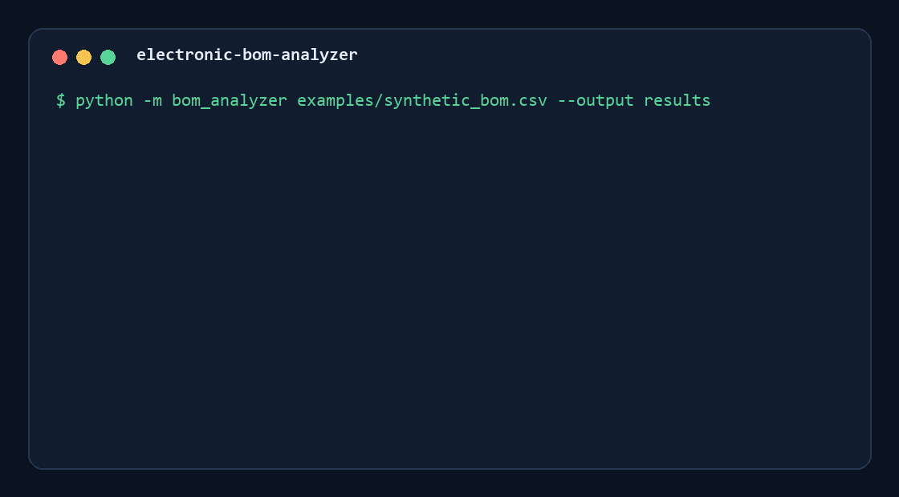

# Electronic BOM Analyzer

A privacy-safe command-line tool for validating electronic Bills of Materials (BOMs). It reads CSV or XLSX files, normalizes common column names, detects missing data and duplicate or conflicting entries, and generates machine-readable reports.

## Features

- CSV and XLSX input support
- Flexible aliases for common BOM column names
- Required-field and quantity validation
- Duplicate manufacturer-part-number detection
- Conflict detection for inconsistent manufacturer or description data
- Reference-designator duplicate detection
- Consolidated component quantities
- JSON and standalone HTML issue reports plus normalized CSV output
- Privacy-safe extension interface for official lifecycle/stock APIs
- GitHub Actions tests on Python 3.10 and 3.12
- Standard-library test suite

## Installation

Python 3.10 or newer is recommended.

```bash
python -m venv .venv
```

Activate the environment and install the optional XLSX dependency:

```bash
python -m pip install -r requirements.txt
```

CSV analysis works without third-party packages.

## Usage

Analyze the included synthetic example:

```bash
python -m bom_analyzer examples/synthetic_bom.csv --output results
```

The command creates:

- `normalized_bom.csv`: normalized and consolidated BOM data
- `bom_report.json`: summary, warnings, and errors
- `bom_report.html`: portable visual report for engineering review

Exit code `0` means that no errors were found. Exit code `1` means that the BOM contains validation errors.

## Supported columns

The analyzer recognizes common aliases for:

- `part_number`
- `manufacturer`
- `manufacturer_part_number`
- `description`
- `quantity`
- `references`

Column matching ignores case, spaces, hyphens, and underscores. See `bom_analyzer/schema.py` for the complete alias list.

## Example output

```text
Rows read: 5
Unique components: 4
Errors: 1
Warnings: 2
Report: results/bom_report.json
Normalized BOM: results/normalized_bom.csv
HTML report: results/bom_report.html
```



A static preview is also available at [`docs/report-preview.png`](docs/report-preview.png).

The data under `examples/` is synthetic and contains no customer, supplier, pricing, or procurement information.

## Tests

```bash
python -m unittest discover -s tests -v
```

## Scope and limitations

This project performs structural validation and consolidation. Optional lifecycle or stock integrations are disabled by default and must use documented vendor APIs with user-supplied credentials. The tool does not recommend real substitute components or make purchasing decisions. Engineering review of datasheets and application requirements remains necessary.

## License

Released under the MIT License.
